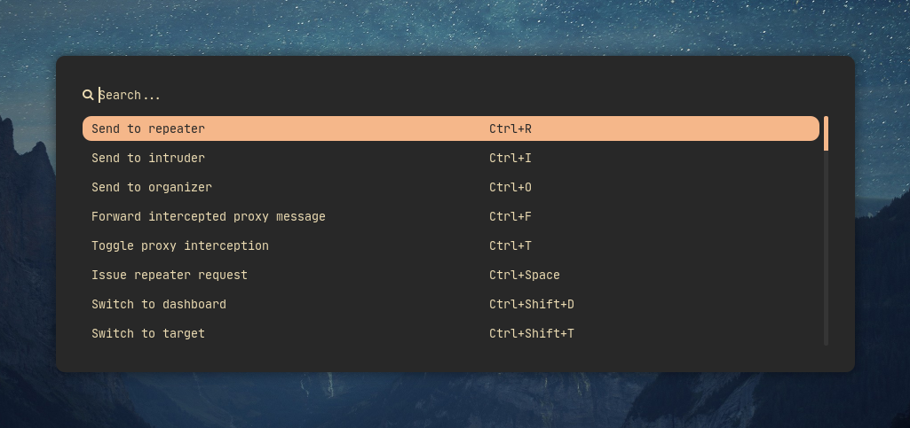

<h1 align="center">
Cheatmenu Sheets
</h1>
<p align="center">Cheat sheets for convenient reminding yourself what keys to press and what commands to execute.</p>

<p align="center">
  <a href="#sheets-overview">Sheets overview</a> •
  <a href="#how-to-create-a-cheatsheet">How to create a cheatsheet</a> •
  <a href="#where-to-put-a-converter">Where to put a converter</a>
</p>

----
Cheat sheets are a core of the [cheatmenu](https://github.com/tokiakasu/cheatmenu). They're used to generate a dynamic application selection menu and cheat list itself.

If you have JSON [then convert it to YAML](https://gist.github.com/noahcoad/46909253a5891af3699580b8f17baba8) or YAML files with a hotkeys or any useful application commands, submit them via pull request or Github issues to populate the list.

## Sheets overview

The symbol (+) indicates the presence of a script for converting the modified config into a YAML file (relevant only for cheat sheets with hotkeys).

| APPLICATION   |  TYPE   |
| ------------- | ------- |
| burpsuite (+) | hotkey  |
| nmap          | command |    
| docker        | command |

## How to create a cheatsheet

A cheat sheet is defined in a YAML file with following structure:

```yaml
application: application-name
shortcuts:
- action: description-1
  command: command-1
- action: description-2
  command: command-2
- action: description-3
  command: command-3
# Add more shortcuts...
```

Each YAML file is located in the application name directory inside the "sheets" directory.

```directory
burpsuite
├── burpsuite.yaml
└── converter
    └── burp2yaml.py
docker
└── docker.yaml
nmap
└── nmap.yaml
```

### Example 1

YAML file for Burp Suite cheatsheet

```yaml
application: burpsuite
shortcuts:
- action: Send to repeater
  command: Ctrl+R
- action: Send to intruder
  command: Ctrl+I
- action: Send to organizer
  command: Ctrl+O
- action: Forward intercepted proxy message
  command: Ctrl+F
- action: Toggle proxy interception
  command: Ctrl+T
```

### Example 2

YAML file for nmap cheatsheet

```yaml
application: nmap
shortcuts:
- action: Find NSE scripts
  command: locate .nse | grep ftp
- action: Help manual for scripts
  command: nmap --script-help ftp-anon
- action: Scan a target using all NSE scripts. May take an hour to complete.
  command: nmap -p 80 --script=all 10.0.0.1
- action: Filter all the IPs from result file
  command: grep -o '[0-9]\{1,3\}\.[0-9]\{1,3\}\.[0-9]\{1,3\}\.[1-9]\{1,3\}' alive.xml | uniq
- action: Initial scan TCP
  command: nmap -sC -sV -O -oA nmap/initial 10.10.10.3
- action: Discover hosts via ICMP requests
  command: sudo nmap -sn -PE 10.124.0.0/26 --disable-arp-ping --source-port 53
- action: Agressively scan all ports
  command: nmap -p- -sV -A -T4 scanme.nmap.org
- action: Insert data to all of the ICMP packets
  command: sudo nmap -sn -PE --data-string 'randddo' 10.124.0.0/26 --disable-arp-ping --source-port 53
```

## Where to put a converter

The converter should be able to work from the command line and be able to get the name of the configuration file through an argument or flag.

If you have found a way to convert the modified config to a YAML file, put the converter script in the "converter" folder inside the cheat sheet folder

For example, a converter for Burp Suite config is located in `burpsuite/converter` directory.


```directory
burpsuite
├── burpsuite.yaml
└── converter
    └── burp2yaml.py
```
